# Schvalovací systém – Approval Workflow (Spring Boot + React)

Fullstack webová aplikace pro správu schvalovacích žádostí.  
Uživatelé vytvářejí žádosti, které schvalovatelé nebo administrátoři mohou schválit nebo zamítnout.

Projekt slouží jako demonstrační aplikace pro práci s:
- REST API a vrstvená architektura (Controller → Service → Repository)
- Spring Security s HTTP Basic Auth a rolemi
- React frontend s komponentami, hooky a stavem
- Validace vstupních dat na backendu i frontendu

---

## Testovací účty

| Jméno   | Email                | Heslo         | Role     |
|---------|----------------------|---------------|----------|
| Dominik | dominik@seznam.cz    | heslo123      | USER     |
| Petr    | petr@seznam.cz       | heslo123      | APPROVER |
| Filip   | filip@seznam.cz      | heslo123      | ADMIN    |

## 🌐 Live ukázka aplikace : https://schvalovaci-system.vercel.app/

## Ukázky obrazovek

### Přihlášení
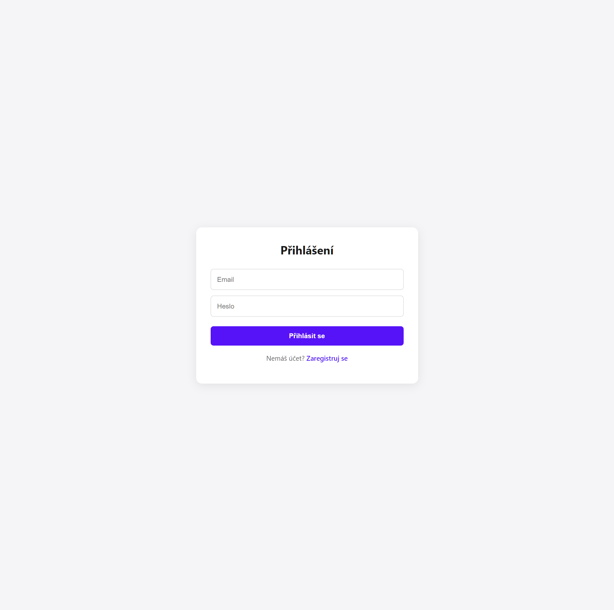

### Přihlášení – validace
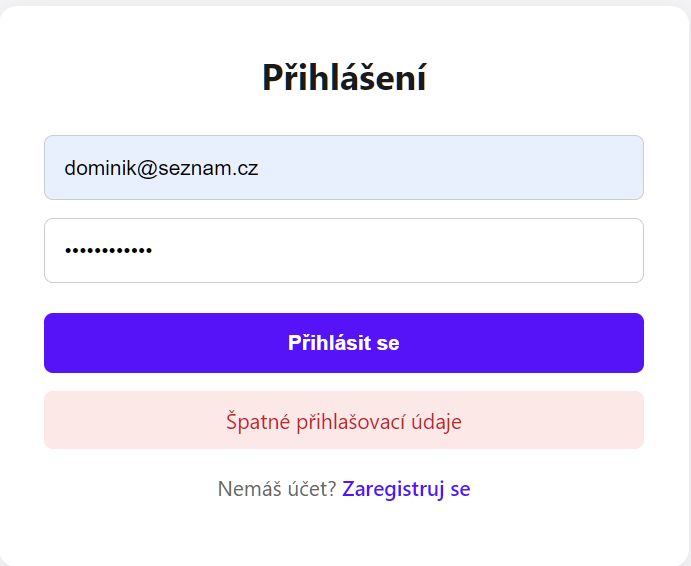

### Přihlášení – validace (email)
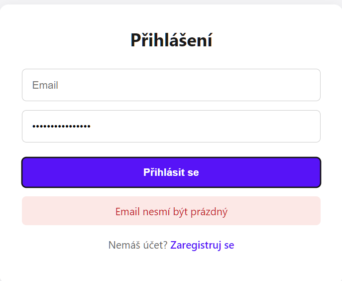

### Přihlášení – validace (heslo)
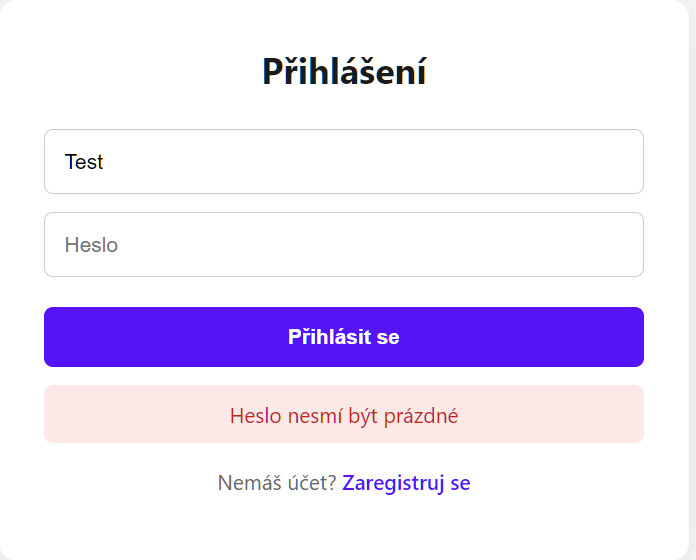

### Registrace – validace
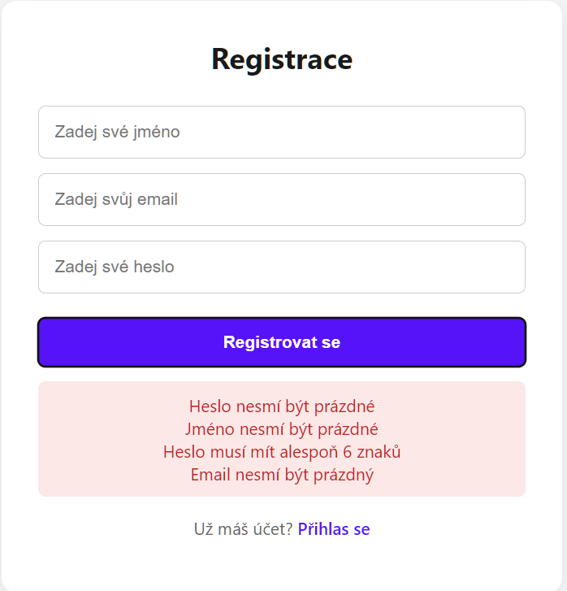

### Hlavní přehled žádostí (APPROVER)
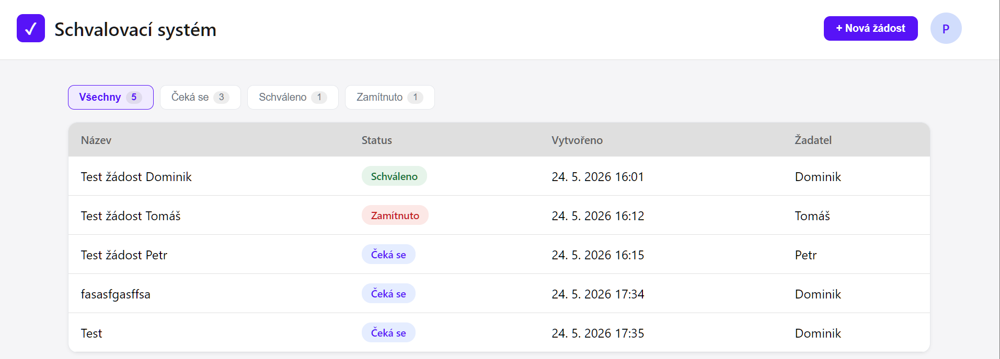

### Hlavní přehled žádostí (USER)
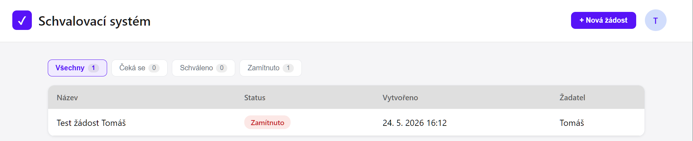

### Filtrování – Čeká se
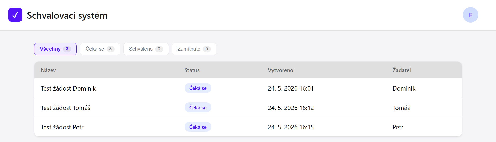

### Filtrování – Schváleno
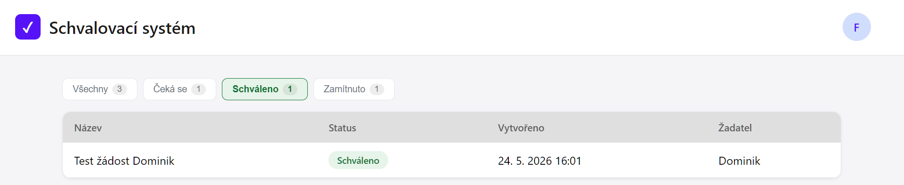

### Filtrování – Zamítnuto
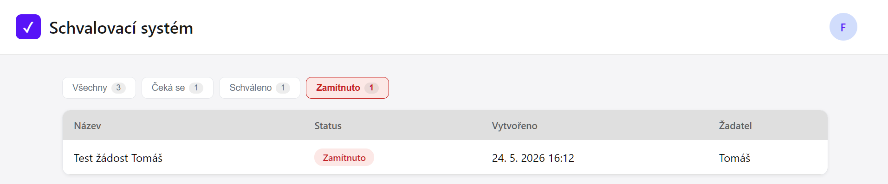

### Prázdný stav filtru 1
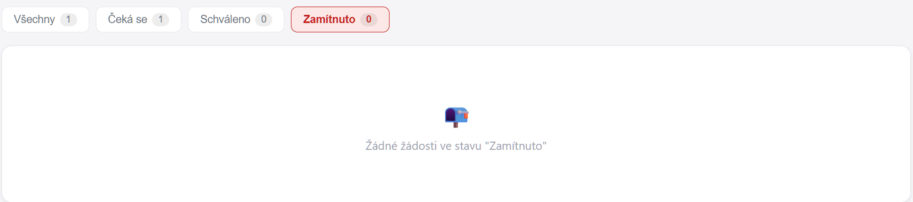

### Prázdný stav filtru 2
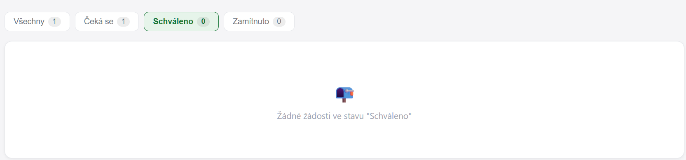

### Vytvoření žádosti
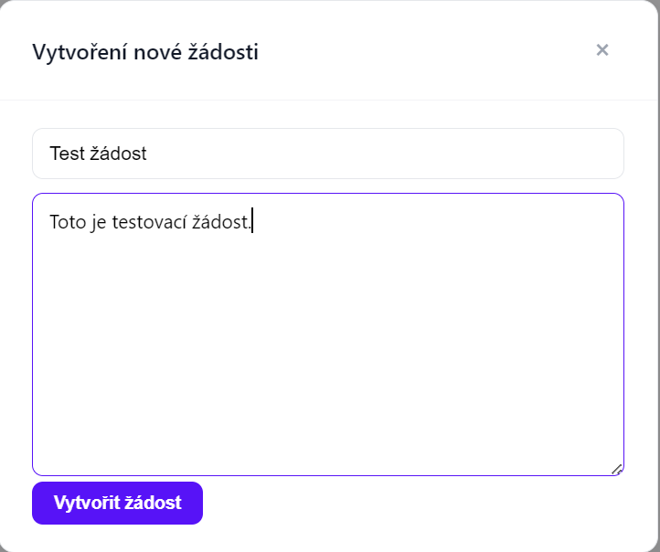

### Vytvoření žádosti - validace (velikost titulku)
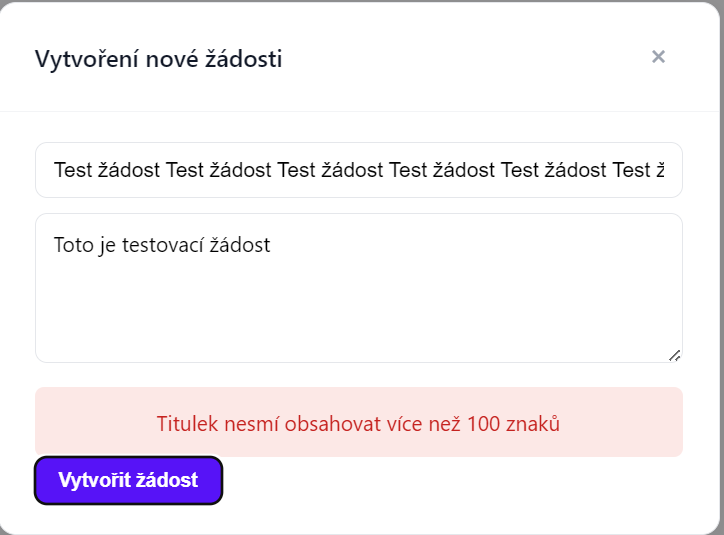

### Vytvoření žádosti - validace (velikost popisku)
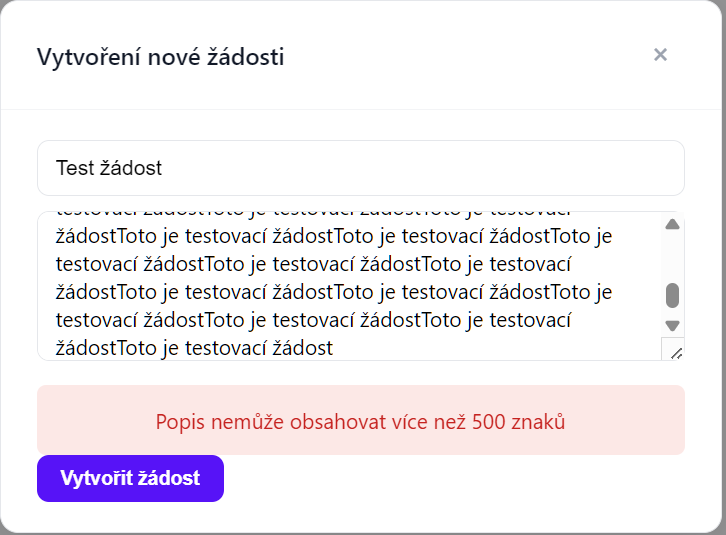

### Detail žádosti (USER – bez tlačítek)
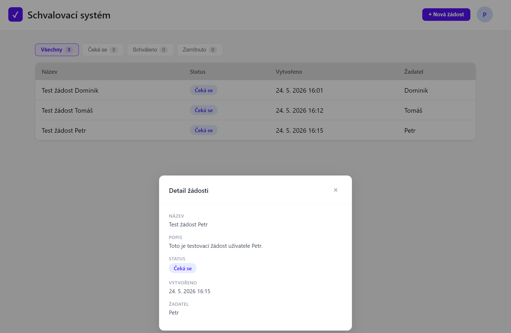

### Detail žádosti (APPROVER – se schválením)
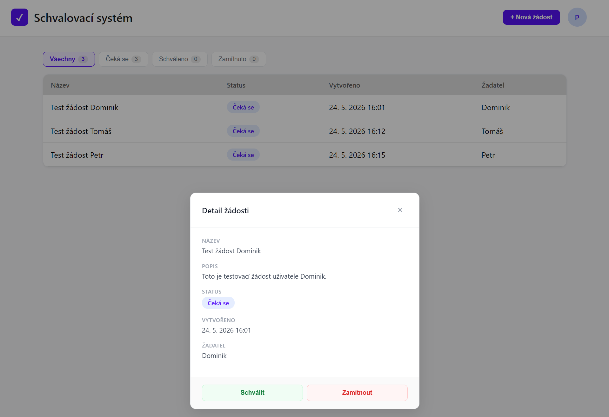

### Toast – žádost schválena
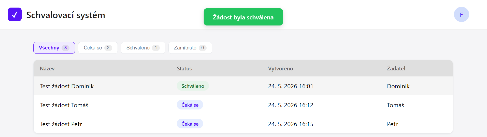

### Toast – žádost zamítnuta
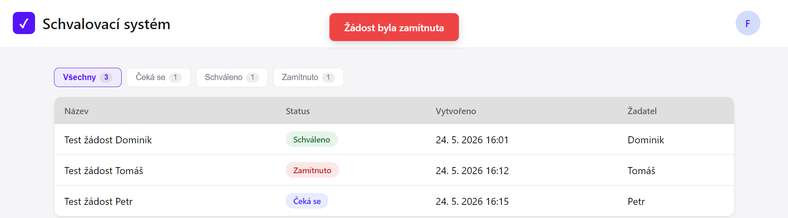

### Toast – žádost vytvořena
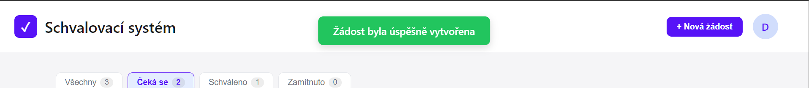

---

## Funkce

### Uživatel (USER)
- Registrace a přihlášení
- Vytvoření nové žádosti s názvem a popisem
- Zobrazení pouze vlastních žádostí
- Filtrování žádostí podle statusu

### Schvalovatel (APPROVER)
- Zobrazení všech žádostí v systému
- Schválení nebo zamítnutí cizích žádostí
- Nelze schválit vlastní žádost

### Administrátor (ADMIN)
- Zobrazení všech žádostí
- Schválení nebo zamítnutí žádostí
- Nemůže vytvářet žádosti

### Backend
- REST API s vrstvená architekturou
- Spring Security – HTTP Basic Auth, BCrypt hashování hesel
- Validace vstupních dat (@NotBlank, @Email, @Size)
- Globální zpracování výjimek
- Role-based přístup k endpointům
- MySQL databáze

---

## Spuštění projektu

🌐 Live ukázka : https://schvalovaci-system.vercel.app/

### Předpoklady
- Java 21+
- Maven
- Node.js + npm
- MySQL

### Spuštění backendu
1. Klikni na zelené tlačítko **Code** na GitHubu
2. Zvol **Download ZIP** a rozbal do složky
3. Otevři složku `backend` v IntelliJ IDEA
4. V `application.properties` nastav připojení k MySQL databázi
5. Najdi třídu `ApprovalWorkflowApplication` a spusť aplikaci
6. Backend běží na `http://localhost:8080`

### Spuštění frontendu
1. Otevři terminál ve složce `frontend`
2. Zadej `npm install`
3. Zadej `npm start`
4. Aplikace běží na `http://localhost:3000`

---

## Použité technologie

**Backend:** Java 21, Spring Boot, Spring Security, Spring Data JPA, Hibernate, MySQL, Maven

**Frontend:** React, JavaScript, CSS

